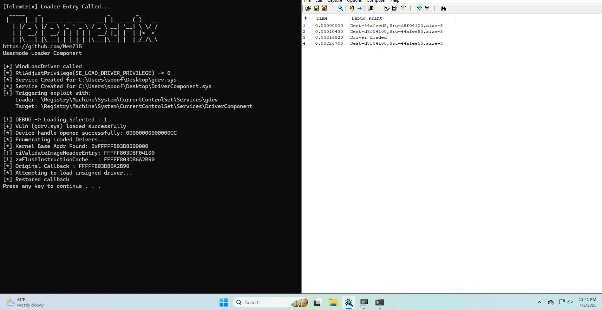

# Telemetrix

**Telemetrix** is an early-stage hardware identity abstraction tool (HWID spoofer) designed for research and testing purposes in controlled environments. It provides mechanisms for selectively masking or modifying hardware identifiers used by modern Windows systems to bind software or licenses to a specific device.

---

## 🚧 Project Status

This project is currently in **active development**. The core architecture is being designed with an emphasis on:

- Kernel Base Address
- Retrieval of user-mode and kernel functions
- DSE bypass

---

## 🎯 Purpose

Telemetrix aims to offer a modular, clean, and efficient foundation for working with hardware-based fingerprinting systems. By intercepting and redirecting calls to system components responsible for hardware queries, Telemetrix can abstract or spoof identifiers such as:

- Motherboard serials
- Volume IDs
- MAC addresses
- CPU and BIOS descriptors

---

## ⚠️ Disclaimer

Telemetrix is intended for educational and ethical research purposes **only**. Misuse of this software, including attempts to circumvent licensing, anti-cheat, or security systems, may violate local laws and terms of service. The authors do not condone or support illegal activity, and all responsibility lies with the end user.

---

## Demo

---
## 📌 Roadmap

- [ ] Core abstraction layer for identifier redirection
- [ ] Modular driver design with NT kernel compatibility
- [ ] Minimal user-mode interface (if needed)
- [ ] Integration testing against known fingerprinting systems
- [ ] Extended support for virtualization contexts

---

## 📂 License

This project will be released under a suitable open-source or research-use license once it reaches a stable milestone. Until then, no redistribution is permitted without explicit permission.

---

